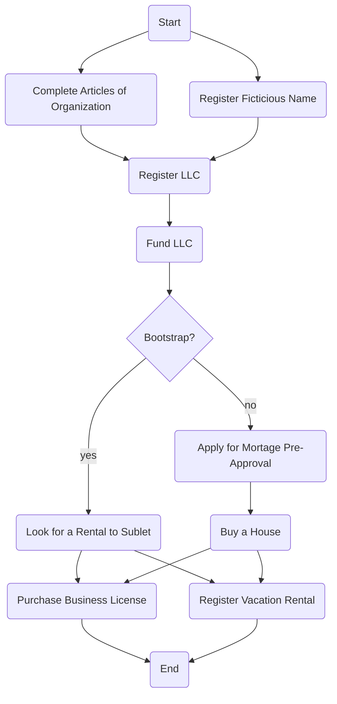

Nautes is a crew house situated in Fort Lauderdale Florida, USA.
It offers weekly boarding at the house and includes services such as electricity, water, wifi, toilet-paper, gas and general maintenance.

It is a 4 bedroom 2+ bathroom house situated <30 minutes from the marina.

The house has room for 10 people with 3 rooms with 2 beds and 1 with 4.
The weekly rate for the house is $350 paid on the 1st of each month.
## LLC
This will be a whole thing.
### Registration Fee
#### Cost before registering your Florida LLC
Unlike most states, Florida doesn't offer name reservation before LLC registration. Instead, you can register what's known as a "fictitious" name for your LLC.

If you don't necessarily want to start your LLC under your legal name, you can do business under a different name, also known as a "doing business as" (DBA ) name. You must register and file your DBA name with the [Florida Division of Corporations.](http://form.sunbiz.org/pdf/CR4E001.pdf) There is a $50 filing fee, and the name is valid for five years.
#### Costs of registering Your Florida LLC
In order to form an LLC, most states require you to draft and file articles of organization. The [articles of organization](https://www.legalzoom.com/articles/llc-articles-of-organization) is a document that officially establishes your LLC by laying out basic information about your business. You can file your articles of organization with the [Florida Division of Corporations](https://efile.sunbiz.org/llc_file.html) for $100.All LLCs are required to appoint a registered agent. A [registered agent](https://www.legalzoom.com/articles/what-is-a-registered-agent) is a person or entity authorized to receive service of process and other official legal documents and notices on behalf of your LLC. You may have the owner or an employee serve as your registered agent, but keep in mind this individual has to be available at all times to receive documents. Many LLCs opt to hire a third-party registered agent service. The cost can range anywhere between $50 to $500 annually.

Florida has a mandatory registration fee of $25 regardless of whether you use an in-house or outside service for an agent.

Articles of organization in Florida must be filed with the Florida Division of Corporations. There is a $125 processing fee, which includes the designation of the registered agent. The processing time in Florida is usually between 2 to 14 business days.
### Business License
COLLECTIVE VACATION RENTAL DWELLING Flat Rate……....$150.00 HOTEL, MOTEL, TRANSIENT APARTMENTS * State License from Dept of Business Regulations Hotel/Restaurant Division 850-487-1395
https://www.broward.org/RecordsTaxesTreasury/TaxesFees/Documents/ClassificationCodes.pdf
### Corporate Income Tax
The Florida corporate income/franchise tax rate is reduced from 5.5% to 4.458% for taxable years beginning on or after January 1, 2019, but before January 1, 2021. The tax rate is further reduced to 3.535% for taxable years beginning on or after January 1, 2021, but before January 1, 2022.

|Taxable Year Beginning|Prior to 1/1/2019|1/1/2019 - 12/31/2020|1/1/2021 - 12/31/2021|On or after 1/1/2022|
|---|---|---|---|---|
|Taxable Rate|5.5%|4.458%|3.535%|5.5%|

Taxpayers that have a 52 - 53 week taxable year beginning on or about January 1 and ending on or about December 31 have the same tax rates as a calendar year-end taxpayer. For more information, see the Department's [Corporate Income Tax](https://floridarevenue.com/taxes/taxesfees/Pages/corporate.aspx "Corporate Income Tax - Link will open in a new window") webpage.

https://floridarevenue.com/taxes/taxesfees/Pages/tax_interest_rates.aspx

### Rental Sales Tax
Individual Florida counties and certain cities may impose a local option tax on the rental or lease of living, sleeping, or housekeeping accommodations for a term of six months or less. These taxes, often called local option transient rental taxes, include the tourist development tax, convention development tax, tourist impact tax, and municipal resort tax. The local tax imposed is in addition to the 6% state sales tax and any applicable discretionary sales surtax. 0-5% LOTR Tax depending on county.
## Acquisition
To purchase a house of that size in the Fort Lauderdale area we need about $350,000.
An example of a potential candidate is here: [724 Burlington Street](https://www.zillow.com/homedetails/724-Burlington-St-Opa-Locka-FL-33054/43995835_zpid/).
### Mortgage
- $17,500 down payment
- Mortgage the remaining $332,500 @ 6.5% over 15 years:
- Mortgage Payments: $2,896
- Property Taxes: $321 (city, county, state)
- Homeowners Insurance: $233 ?
- Private Mortgage Insurance: $139 ?

## Operation
The house needs to be maintained and kept in working order.
There are also business licenses and fees that must be paid in order to operate the business.
### Utilities
- $200 per month on utilities
- $100 per month on supplies
### License
- **Registration:** Fort Lauderdale vacation rentals must be registered with the city on an annual basis. You need to pay a $350 registration fee for as many as four rental units under the same roof. Also, the renewal registration fee is $80 for owner-occupied and $160 for non-owner-occupied vacation rentals.
- **Business Tax License:** Operators of [Fort Lauderdale Airbnb rentals](https://www.mashvisor.com/blog/airbnb-fort-lauderdale-2018/) need to obtain a business tax license as the city considered running short-term rental properties as a business strategy. Depending on the time of the year, the cost of a business license in Fort Lauderdale, FL ranges between $78 and $236
- **Inspection:** Your Fort Lauderdale investment property must abide by a set of rules. Airbnb Fort Lauderdale properties, therefore, undergo a home inspection to confirm that they obey these rules. The cost of the first two inspections is included in the registration fee, while every subsequent inspection costs $75.
- **Taxes:** Similar to other [Florida vacation homes](https://www.mashvisor.com/blog/best-places-to-buy-a-vacation-home-in-florida/), similar properties in Fort Lauderdale must pay the 6% Florida transient rental tax, 6% Broward County tourist development tax, and 0.5-1.5% Florida discretionary sales surtax.
- **Others:** It’s important to understand and abide by the other regulations and contracts that bind you. Many condo complexes, for example, ban short-term rentals in their housing units. So, before buying Fort Lauderdale [condos for sale](https://www.mashvisor.com/blog/positive-cash-flow-condos-for-sale/) to rent out on Airbnb, remember to check the HOA’s rules and regulations in this regard.
- HOA: There may be a home owners association fee that is payable as well.

## Rentals
The house has 3 bedrooms with 2 beds @ $350 / week and 1 bedroom with 4 beds at $250 / week.
### Example Competitor
### Crossroads Crew House - 4 BED S / 2 BATH S

#### From $235 / Week - Student: From $225 / Week

CrossRoad Crew House is our largest crew house! Located on SE 17th Street in Fort Lauderdale.

Crew Housing is only for members of the yachting/marine industry.

**4 bedrooms and 2 bathrooms** – walking distance to Professional Yacht Training PYT.

**SHARED/BED =** you will have 1-3 roommates. 

 **PRIVATE Room/Single Room** = single room to yourself

Location – Location – Location! No car is needed! Opposite Whole Foods!

We have crew staying with us that are at all stages of their career. Yacht Crew come to network at our crew houses as well as use our crew houses while studying. If you are a yachtie, our crew housing is for you!

- 0.3 miles to Maritime Professional Training (MPT)
- 0.1 miles to Professional Yacht Training (PYT)
- 2.6 miles to Blue Water
- 1.8 miles to Lauderdale Marine Center (LMC)

1. 2-3 beds in each room.
2. Single Beds and Bunk Beds
3. This crew house is **co-ed** 
4. We provide **free Wi-Fi** and Cable.
5. Washer and dryer, It is coin Operated Laundry
6. All towels and linens are provided.
7. This shared crew house is **cleaned once a week** 
8. 5 unassigned parking spaces. 
9. There is a private apartment around the back of this crew house.
10. We provide a **BBQ**

**This house cannot be rented as a whole house. Rented by the bed only.** 

Week to week rentals only.  

_This Short-Term Fully Furnished Rental is available for rent Weekly. Please contact us for availability. *Prices are Seasonal and Vary* Student Discounts Available._

Approved as a City of Fort Lauderdale Vacation Rental, Certificate #20080011

Fully Furnished

BBQ Grill Included

Fully Equipped Kitchen

WATCH VIDEO
](https://www.smartmovecrew.com/crew-housing/crossroads-crew-house-fort-lauderdale-near-se-17th-street-82#video)

- [Cable TV / Satellite](https://www.smartmovecrew.com/crew-housing/crossroads-crew-house-fort-lauderdale-near-se-17th-street-82#)
- [Wi-Fi](https://www.smartmovecrew.com/crew-housing/crossroads-crew-house-fort-lauderdale-near-se-17th-street-82#)
- [Garden](https://www.smartmovecrew.com/crew-housing/crossroads-crew-house-fort-lauderdale-near-se-17th-street-82#)
- [Parking](https://www.smartmovecrew.com/crew-housing/crossroads-crew-house-fort-lauderdale-near-se-17th-street-82#)
- [Free Standing](https://www.smartmovecrew.com/crew-housing/crossroads-crew-house-fort-lauderdale-near-se-17th-street-82#)
- [Laundry Facilities](https://www.smartmovecrew.com/crew-housing/crossroads-crew-house-fort-lauderdale-near-se-17th-street-82#)
- [Study / Den](https://www.smartmovecrew.com/crew-housing/crossroads-crew-house-fort-lauderdale-near-se-17th-street-82#)
- [Basic Cleaning Supplies](https://www.smartmovecrew.com/crew-housing/crossroads-crew-house-fort-lauderdale-near-se-17th-street-82#)
- [Completely equipped bathroom(s)](https://www.smartmovecrew.com/crew-housing/crossroads-crew-house-fort-lauderdale-near-se-17th-street-82#)
- [Electronic Door Locks (no keys)](https://www.smartmovecrew.com/crew-housing/crossroads-crew-house-fort-lauderdale-near-se-17th-street-82#)
- [Flat Screen TVs](https://www.smartmovecrew.com/crew-housing/crossroads-crew-house-fort-lauderdale-near-se-17th-street-82#)
- [Housekeeping service available (additional charge)](https://www.smartmovecrew.com/crew-housing/crossroads-crew-house-fort-lauderdale-near-se-17th-street-82#)
- [Wooden floors](https://www.smartmovecrew.com/crew-housing/crossroads-crew-house-fort-lauderdale-near-se-17th-street-82#)

## Business Plan

We need to find someone who can take out the mortgage for us, or just sublet a place to begin with. The bank is unlikely to give credit to an entity with no credit history and funded by individuals with variable incomes.